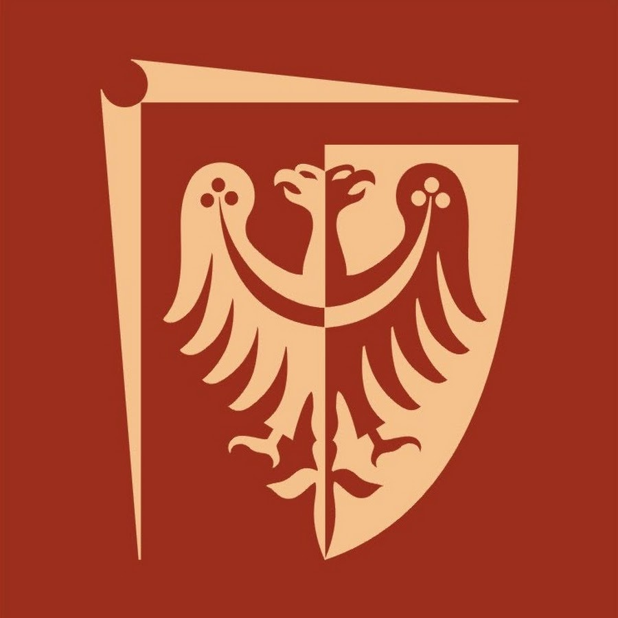
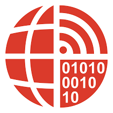
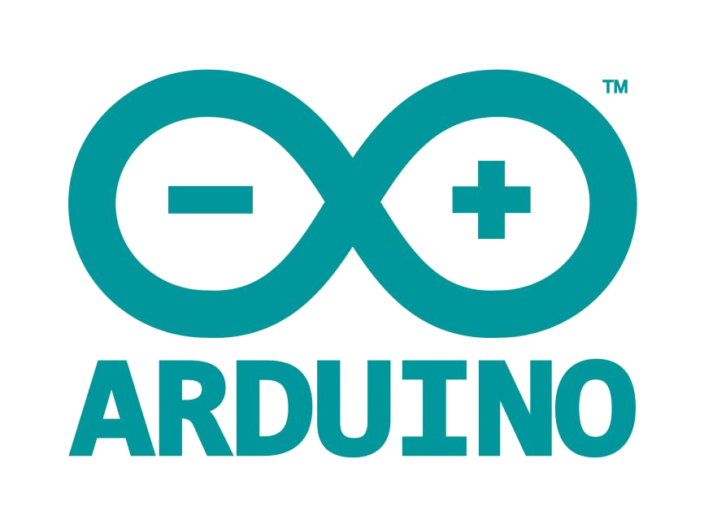
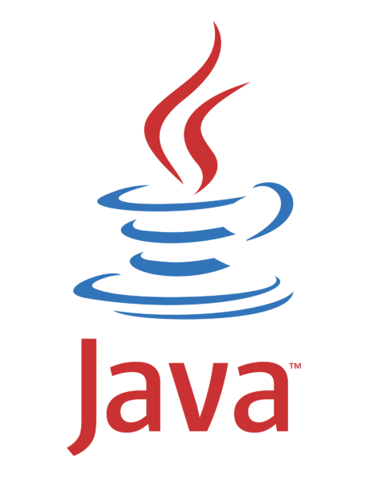

## Hello there, Dear Sir or Madam 

    

        This Github account belongs to the student of applied computer science at Wroclaw University of Science & Technology since 2020, considering himself a self-taught programmer, math and electronics geek since 2018
    

    
    

### About me

20 yrs old smalltown boy from Cuiavia

Fan of books:book:, cycling:bicyclist:, exploring new places and learning new things:open_mouth:

Started my adventure with Arduino and embedded, later with web development, not sure what to do in the future yet

    
    
    
    
    
     

### "Talk is cheap, show me the code" ~~ Linus Torvalds

    
    

